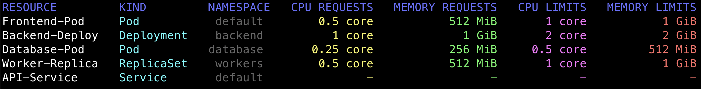

# aligntable

`aligntable` simplifies data visualization in the console environment, making it effortless to present data legibly 
and aesthetically through well-aligned tables and hierarchical trees.

```bash
$ go get github.com/semihbkgr/aligntable@v0.1.2
```

## Usage

To get started with `aligntable`, refer to the examples in the [_examples](_examples) directory. These examples 
showcase how to create aligned tables and hierarchical trees, providing insight into the capabilities of the library.

## Console Output

Check out the screenshot below to see the console output generated by [the example](_examples/colorize.go):



## Table

It is the [example](_examples/table.go) of how to print data in table form

```go
t := aligntable.New()
t.Rows = []*aligntable.Row{
    {
        Cells: []*aligntable.Cell{
            {Text: "NAME"},
            {Text: "AGE"},
            {Text: "CITY"},
        },
    },
}

for _, entry := range unmarshalTableData() {
    t.Rows = append(t.Rows, &aligntable.Row{
        Cells: []*aligntable.Cell{
            {Text: entry["Name"].(string)},
            {Text: strconv.Itoa(entry["Age"].(int))},
            {Text: entry["City"].(string)},
        },
    })
}

fmt.Println(t)
```

```
NAME     AGE   CITY
Alice    28    New York
Bob      35    Los Angeles
Connor   22    Chicago
Daniel   30    Houston
Emily    29    San Francisco
```

## Tree

It is the [example](_examples/tree.go) of how to print data in tree form

```go
t := aligntable.Tree{}
t.Nodes = []*aligntable.Node{
    {
        Text: "Fruits",
        SubNodes: []*aligntable.Node{
            {
                Text: "Citrus",
                SubNodes: []*aligntable.Node{
                    {Text: "Orange"},
                    {Text: "Lemon"},
                    {Text: "Lime"},
                },
            },
            {
                Text: "Berries",
                SubNodes: []*aligntable.Node{
                    {Text: "Strawberry"},
                    {Text: "Lemon"},
                    {Text: "Blueberry"},
                },
            }, 
...
```

```
Fruits
├───────── Citrus
│          ├────────────── Orange
│          ├────────────── Lemon
│          └────────────── Lime
├───────── Berries
│          ├────────────── Strawberry
│          ├────────────── Lemon
│          └────────────── Blueberry
└───────── Tropical
           ├────────────── Mango
           ├────────────── Pineapple
           └────────────── Blueberry
Vegetables
├───────── Leafy Greens
│          ├────────────── Lettuce
│          └────────────── Spinach
└───────── Root Vegetables
           ├────────────── Carrot
           ├────────────── Potato
           └────────────── Beetroot
```
